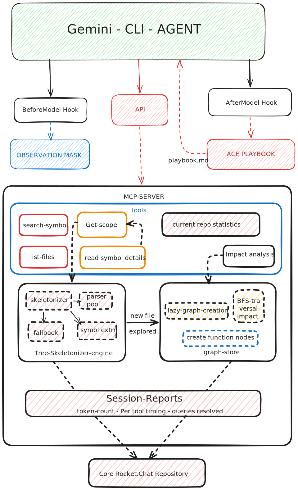
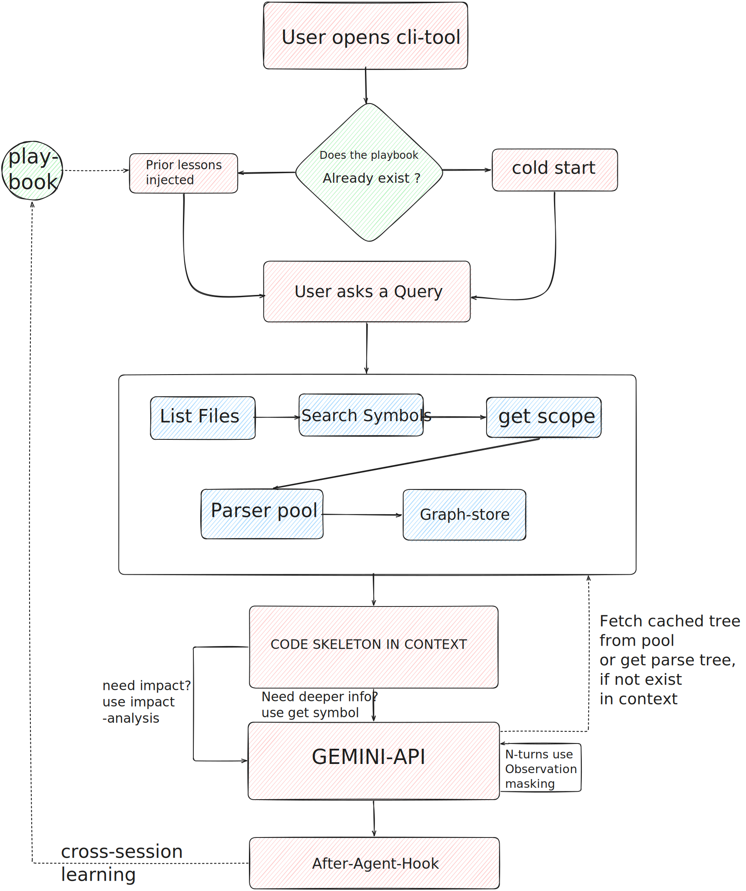

# Rocket.Chat Code Analyzer — gemini-cli Extension

> ⚠️ **Work In Progress** : This is a proof-of-concept implementation developed as part of a GSoC 2026 proposal. Several components are incomplete, placeholder, or under active redesign. See the [Known Issues](#known-issues) and [Incomplete / Placeholder Implementations](#incomplete--placeholder-implementations) sections before use.

A `gemini-cli` extension that makes the Rocket.Chat monorepo (~2.1 GiB) genuinely navigable within the constraints of Google's free-tier inference budget. Built around domain-specific context reduction mechanisms that exploit the structural properties of code to achieve reductions that are qualitatively different from general-purpose compression.

**Source:** https://github.com/Kaustubh2k5/Gsoc-POC-RC

---

## The Problem

Pointing a CLI agent at a production monorepo reveals two compounding problems:

**Ingestion bloat** : even compressed file representations accumulate faster than the context window can absorb them at scale. Existing solutions such as KV caching and llm-lingua compression are O(n), they slow the problem without stopping it.

**Trajectory elongation** : as a session progresses, the agent's own history fills with stale tool outputs. Up to 84% of tokens in a typical agent session are consumed by raw observations the agent has already acted on and no longer needs in full.

This extension tackles both problems separately using domain-specific strategies — exploiting the fact that code has a fixed grammar, explicit dependency declarations, and a clean separation between interface and implementation that generic text does not.

---

## Architecture




---

## How It Works

### Session lifecycle

1. **Session start** : `GEMINI.md` is checked. If it exists, prior learned lessons are injected into context immediately. If not, the agent starts cold.
2. **Discovery** : the agent calls `list_files` → `search_symbol` → `get_scope` in sequence, narrowing from the full repo to the relevant dependency neighbourhood.
3. **Parse and graph build** : `get_scope` triggers `ensureFile` per relevant file. Each file is read from disk, parsed by tree-sitter, its tree cached in the parser pool, a skeleton extracted, and nodes/edges added to the graph store.
4. **Agent reasons** : skeletons are in context. The agent calls `read_symbol_details` to hydrate specific function bodies at near-zero cost (tree is already cached), and `blast_radius` to understand impact.
5. **Masking** : as turns accumulate, the `BeforeModel` hook fires before every API call, replacing old tool outputs with compact placeholders. Reasoning and action messages are never touched.
6. **Session end** : the `AfterAgent` hook runs the Reflector , Curator , Generator pipeline, extracting architectural lessons from the transcript and appending them to `GEMINI.md`.

### Why it works

Code is not generic text. It has a fixed grammar, explicit dependency declarations, and a clean boundary between interface and implementation. This means:

- Information loss is **predictable** : stripping function bodies always leaves signatures intact
- Dependencies are **machine-readable** : import statements encode the full dependency graph
- Masked content is **freely recoverable** : the codebase on disk is the ground truth, and the parser pool cache makes re-extraction near-zero cost
- Architectural patterns are **stable** : lessons learned about file locations and conventions remain valid across many sessions

These properties combine: cheaper discovery enables targeted skeletonisation, which enables precise graph construction, which enables cheaper discovery next time. Each session compounds on the last.

---

## Installation

```bash
# clone the extension
git clone https://github.com/Kaustubh2k5/Gsoc-POC-RC
cd Gsoc-POC-RC
npm install

# point gemini-cli at the extension
gemini --extension ./path/to/extension

# or run the MCP server directly for testing
REPO_ROOT=/path/to/rocketchat node debug-monitor.js
```

The extension reads `gemini-extension.json` at its root, which wires the MCP server, hooks, and `GEMINI.md` context file automatically.

---

## MCP Tools Reference

| Tool | Purpose | Typical call order |
|---|---|---|
| `list_files` | Browse repo file tree | 1st |
| `search_symbol` | Find symbol by name across repo | 2nd |
| `get_scope` | Scoped skeletons via dependency BFS | 3rd |
| `read_file_skeleton` | Single file skeleton | As needed |
| `read_symbol_details` | Full source of one symbol | When deeper read needed |
| `blast_radius` | What breaks if I change this? | Before making changes |
| `resolve_meteor_method` | Meteor method name → file | Meteor-specific lookup |
| `resolve_alias` | TS path alias → filesystem path | Import resolution |
| `repo_stats` | Session token usage + graph state | Health check |
| `reindex` | Reset graph and rediscover files | After major changes |

---

## Data Flow




---

## Known Issues

These are confirmed bugs or design weaknesses in the current implementation:

**Graph pending edges leak memory.** When file A calls a function from file B and file B is never visited in the session, the pending edge sits in `_pendingEdges` indefinitely. No eviction or TTL exists on pending entries.

**Graph has no cycle detection in import resolution:** Circular imports can cause the same file to be added to the frontier multiple times before being parsed. A `_inProgress` set is needed in `_parseFile`.

**Graph `ContentIndex` and `GraphStore` coexist**: Both indexers are present in the codebase. `debug-monitor.js` uses `GraphStore` but `ContentIndex` with its MD5 cache is still present, creating ambiguity about which is the source of truth. During file updates and code updates this is problematic as it creates a divergent path on 2 data sources whihc point to the same thing.

**turn segmentation is fragile**: `segmentIntoTurns` identifies boundaries by looking for a model message with no `tool_use`. Multi-step tool call chains produce multiple model messages in a row, which are incorrectly treated as separate turn boundaries. The fix is to use user message boundaries instead.

**Token estimates are rough:** The 1 token per 4 characters heuristic underestimates TypeScript source, which tokenises closer to 1 per 3.5 characters due to type annotations and long identifiers. Instead of this query the Gemini api directly to get a count of the tokens.

**Observation masking has naive masking strategy** The masking hook does not distinguish between successful tool outputs and error responses. Masking an error message removes a failure signal the agent needs for self-correction.

**Playbook's naive TF-IDF** : The current cosine similarity uses raw term frequency with no IDF weighting. Common words like `file`, `function`, `apps`, `meteor` dominate the score, causing false deduplication of lessons about different things and failing to deduplicate lessons about the same thing worded differently.

**Regex call site fallback produces noisy graph edges** :`extractCallSitesRegex` matches any `identifier(` pattern and skips only a small hardcoded keyword list. This produces false edges from type assertions, decorators, and generic instantiations in TypeScript files.

**`get_scope` token budget is a hard binary cutoff.** Files that exceed the budget are dropped entirely rather than served at reduced skeleton depth. A file 200 tokens over budget receives the same treatment as one 10,000 tokens over.

---
## Future Directions

The following are either not yet implemented or implemented in a simplified placeholder form:

**Graph persistence through sessions** : the graph is rebuilt from scratch every session.Each session currently pays the full graph construction cost again. A possible solution is to store the graph across sessions in an MD5 cache

**Token budget awareness** : `repo_stats` tracks token usage but this information does not currently feed back into `get_scope` hydration decisions. The system does not tighten or loosen its loading strategy based on remaining budget.

**Playbook imporvement** : the Curator only deduplicates near-identical lessons. It does not detect two lessons about the same entity that say contradictory things. A lesson from session 3 and a conflicting lesson from session 12 can both survive in the active playbook. Also the current system uses an unstructured form, creating a more structured form that the model can query allows for better scalability.

**content-aware classification** : all tool outputs outside the rolling window are treated equally. Error messages, skeleton outputs, and diagnostic outputs, as important info can be lost we should probably create a better form of masking.

**Playbook lesson metadata** : lessons are stored as flat markdown bullets with no timestamp, session counter, confidence score, or primary entity field. These are needed for staleness detection and contradiction resolution.

**Tiered skeleton depth in `get_scope`** : all files receive the same full five-section skeleton regardless of their relevance score. Depth-1 dependencies should receive exports-only; depth-2 should receive symbol names only.

**Query routing** : no pre-agent classifier exists. The agent always runs the full discovery sequence regardless of whether the query already contains a precise symbol name or file path.

**Incremental graph updates on file change** : the system does not watch for file modifications during a session. Edited files are not re-parsed until the next `ensureFile` call, and even then only if the source string has changed.

---


### Performance targets

The following benchmarks define the performance goals for the complete system. Baseline figures are from unoptimised `gemini-cli` against the Rocket.Chat monorepo:

| Metric | Baseline | Target |
|---|---|---|
| Initial discovery cost | ~150,000 tokens | ~2,000 tokens (JIT) |
| 50-turn session trajectory | ~1,000,000+ tokens | ~120,000 tokens (masked) |
| Session 1 cost (cold) | baseline | measured |
| Session 5 cost (warm playbook) | baseline | ≥75% reduction |
| Skeleton generation per file | full file tokens | 90–97% reduction |
| Cache hit re-extraction | cold parse cost | <1ms |
| Startup time | O(n files) | <500ms (lazy) |
| Blast radius query (depth 4) | O(files × imports) | <10ms (graph BFS) |
| Task solve rate | high (hits limits) | higher (avoids lost-in-middle) |

### Planned features

**Graph persistence** : serialise the graph to disk at session end, validate against file mtimes on reload. Combined with the playbook, returning sessions should approach near-zero discovery cost.

**Proper TF-IDF in the Playbook Curator** : IDF weighting across the lesson corpus, domain stop word filtering, type-gated comparison, and contradiction detection via entity extraction.

**Token budget awareness** : a `BudgetTracker` wired into `get_scope` that dynamically switches between full skeleton, exports-only, and names-only hydration based on remaining TPM headroom. Use Gemini's `countTokens` endpoint for accurate measurement at budget decision points.

**Tiered skeleton depth** : score-dependent skeleton depth in `get_scope`. Seed files receive full skeletons; depth-1 dependencies receive exports only; depth-2 and beyond receive symbol names only.

**Incremental skeleton and graph updates** : tree-sitter's incremental re-parser returns changed node ranges. Only the affected symbol signatures need recomputation on file change. A `FileWatcher` invalidates the parser pool and graph store entries for modified files.

**Query routing** : a lightweight Flash-Lite pre-classifier that routes discovery, reading, and impact queries to the appropriate tool sequence, skipping unnecessary steps for precise queries.

**Upstream contribution** : the `BeforeModel` hook, `AfterAgent` hook, and MCP server architecture are designed to be codebase-agnostic. Contributing these to `gemini-cli` upstream would make every large codebase benefit from the same infrastructure.

**Multi-language support** : tree-sitter is polyglot by design. Extending the grammar map to cover Python, Go, and Rust would make the extension applicable to any large open source monorepo, not just TypeScript projects.

### Research directions

**Graph-guided playbook seeding** : using the graph's metrics (most-called functions, most-imported files) to bootstrap the initial playbook with high-value architectural anchors before any agent session has run.

**Evaluation framework** : a task suite against the Rocket.Chat monorepo with ground truth answers for symbol location, impact scope, and architectural queries. Measures solve rate, token cost, and latency across extension versions to make regressions visible.

---

## Project Structure

```
.
├── gemini-extension.json      # Extension config — MCP server, hooks, context file
├── debug-monitor.js           # MCP server with full instrumentation (primary entry point)
├── index.js                   # MCP server minimal (production entry point)
├── hooks/
│   ├── observation-masking.js # BeforeModel hook — rolling window masking
│   ├── ace-playbook.js        # AfterAgent hook — Reflector → Curator → Generator
│   └── session-report.js      # Session token usage reporter
└── src/
    ├── ts-engine/
    │   ├── index.js           # Public API — skeletonizeFile, extractSymbol, extractCallSites
    │   ├── skeletonizer.js    # AST → skeleton string (five signal categories)
    │   ├── queries.js         # Declaration finder — depth-limited AST walk
    │   ├── parser-pool.js     # Parser reuse + tree cache singleton
    │   └── fallback.js        # Token-stream fallback skeletonizer
    └── index/
        ├── graph-store.js     # Lazy function dependency graph (primary)
        └── content-index.js   # File-level index with MD5 cache (legacy, to be retired)
```

---

## Testing

Testing framework: **Vitest** (native ESM, zero config) with **memfs** for filesystem mocking, **MCP InMemoryTransport** for tool call testing, and **fast-check** for property-based edge case coverage.

```bash
npm test              # unit + integration tests
npm run test:bench    # performance regression benchmarks
npm run test:e2e      # full session lifecycle (requires Rocket.Chat clone)
```

Unit test coverage targets: skeletonizer, graph store, parser pool, observation masking hook, playbook curator. Integration tests run against a curated fixture set of ~30 Rocket.Chat files from the messaging subsystem committed to the repo.

> ⚠️ The test suite is not yet complete. Unit tests for the skeletonizer and graph store exist in partial form. Integration and end-to-end tests are planned for weeks 6–7 of the GSoC timeline.

---

## Acknowledgements

Built as a GSoC 2026 project for Rocket.Chat. Mentor: William Liu.
Built on prior work on [CodeSaathi AI](https://github.com/Kaustubh2k5) and the broader Agentic Context Engineering research direction.
